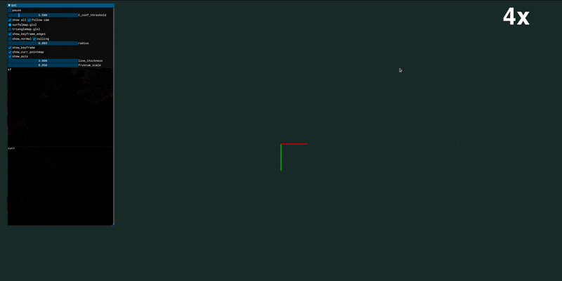

<p align="center">
  <h1 align="center">Spann3R-SLAM: Real-Time Dense SLAM with Spann3R Backend Rendering</h1>
  <p align="center">
    Built on top of <a href="https://edexheim.github.io/mast3r-slam/">MASt3R-SLAM</a> and integrated with <a href="https://hengyiwang.github.io/projects/spanner">Spann3R</a>
  </p>

  <h3 align="center">
    <a href="https://hengyiwang.github.io/projects/spanner">Spann3R Project</a> |
    <a href="https://edexheim.github.io/mast3r-slam/">MASt3R-SLAM Project</a>
  </h3>
  <div align="center"></div>

<p align="center">
    
</p>
<br>

## Overview

Spann3R-SLAM integrates [Spann3R](https://github.com/HengyiWang/spann3r) into a MASt3R-SLAM-style real-time pipeline.
This repo uses copied upstream Spann3R code under `spann3r_core/` (no Spann3R submodule) and runs directly with:

- `checkpoints/spann3r.pth`
- `checkpoints/DUSt3R_ViTLarge_BaseDecoder_512_dpt.pth`
- demo data `datasets/examples/s00567`

### Key Features

- **Spann3R backend**: Tracking/optimization pipeline is wired to Spann3R inference.
- **Interactive 3D visualization**: in3d-based viewer with mouse orbit/pan/zoom and camera frustums.
- **Spann3R reprojection rendering**: Reprojects Spann3R world points (`pts3d + RGB`) to the current view.
- **Per-frame PNG export**: Saves rendered frames by default to `logs/spann3r_renders/`.
- **Runtime tuning**: CLI + GUI controls for point density and rendering quality/performance.

### Differences from MASt3R-SLAM

| Aspect | MASt3R-SLAM | Spann3R-SLAM |
|---|---|---|
| Backend model | MASt3R | Spann3R (+ DUSt3R checkpoint) |
| Real-time render content | OpenGL point map shaders | Spann3R point reprojection renderer |
| PNG render export | Not default | Enabled by default (`logs/spann3r_renders/`) |
| Integration mode | Native MASt3R stack | Upstream Spann3R source copied into repo |

---

## Installation

### Prerequisites

- Ubuntu 20.04+ (or WSL2)
- NVIDIA GPU + CUDA-capable driver
- Conda/Miniconda
- Git

### Step 1: Clone Repository

```bash
git clone --recursive https://github.com/Looong01/Spann3R-SLAM.git
cd Spann3R-SLAM
```

If cloned without `--recursive`, run:

```bash
git submodule update --init --recursive
```

### Step 2: Create Environment

```bash
conda create -n spann3r-slam python=3.11 -y
conda activate spann3r-slam
```

### Step 3: Install PyTorch

Install the CUDA-matching PyTorch for your machine. Example (CUDA 12.4):

```bash
pip install torch==2.5.1 torchvision==0.20.1 torchaudio==2.5.1 --index-url https://download.pytorch.org/whl/cu124
```

### Step 4: Install Dependencies (Recommended Order)

```bash
pip install -r requirements.txt
pip install -e thirdparty/in3d
pip install --no-build-isolation thirdparty/lietorch
pip install --no-build-isolation -e .
```

Notes:

- `pip install --no-build-isolation -e .` builds the backend extension (`mast3r_slam_backends`).
- `lietorch` must be installed before running `main.py`.

---

## Checkpoints

Create the checkpoint directory:

```bash
mkdir -p checkpoints
```

Place the following files in `checkpoints/`:

- `spann3r.pth`
  - https://drive.google.com/drive/folders/1bqtcVf8lK4VC8LgG-SIGRBECcrFqM7Wy?usp=sharing
- `DUSt3R_ViTLarge_BaseDecoder_512_dpt.pth`
  - https://download.europe.naverlabs.com/ComputerVision/DUSt3R/DUSt3R_ViTLarge_BaseDecoder_512_dpt.pth

## Demo Data

Put the example scene at:

```text
datasets/examples/s00567
```

(Download source is the same Google Drive folder above.)

The image-folder loader supports `png/jpg/jpeg`.
Default inference image size is `224` (aligned with current Spann3R demo usage in this repo).

---

## Usage

### Quick Start

```bash
python main.py \
  --dataset datasets/examples/s00567 \
  --checkpoint checkpoints/spann3r.pth \
  --dust3r-checkpoint checkpoints/DUSt3R_ViTLarge_BaseDecoder_512_dpt.pth \
  --config config/base.yaml
```

Minimal command (uses defaults above):

```bash
python main.py
```

Headless mode:

```bash
python main.py --no-viz
```

### Command-Line Arguments

| Argument | Default | Description |
|---|---:|---|
| `--dataset` | `datasets/examples/s00567` | Input sequence folder / video / image folder / `realsense` / `webcam` |
| `--config` | `config/base.yaml` | SLAM config YAML |
| `--save-as` | `default` | Save subdir under `logs/` for trajectory/reconstruction outputs |
| `--no-viz` | off | Disable interactive GUI window |
| `--calib` | `""` | Optional calibration YAML |
| `--checkpoint` | `checkpoints/spann3r.pth` | Spann3R checkpoint path |
| `--dust3r-checkpoint` | `checkpoints/DUSt3R_ViTLarge_BaseDecoder_512_dpt.pth` | DUSt3R checkpoint path |
| `--no-render-gaussians` | off | Disable Spann3R rendering and per-frame PNG export |
| `--render-dir` | `logs/spann3r_renders` | Directory for rendered PNGs |
| `--max-gaussians` | `6291456` | Max active points used by renderer |
| `--spatial-stride` | `1` | Per-frame point subsampling stride (`1` = no subsampling) |

### GUI Controls (Interactive Viz)

When GUI is enabled, the left panel exposes runtime controls:

| GUI Item | Range / Default | Effect |
|---|---:|---|
| `pause` | bool | Pause frame stepping |
| `C_conf_threshold` | `0.0 .. 5.0` (init from config) | Confidence filtering for rendered/visualized points |
| `follow cam` | bool (on) | Viewer follows current camera |
| `spann3r_rendering` | bool (on) | Toggle Spann3R reprojection rendering layer |
| `render_res_scale` | `0.2 .. 2.0` (default `1.2`) | Viewport rendering resolution scale (`>1.0` = supersampling) |
| `spatial_stride` | `1 .. 16` (init from CLI) | Point density control |
| `max_gaussians` | `20000 .. dynamic upper bound` (init from CLI) | Active point cap |
| `render_point_radius` | `0 .. 4` (default `1`) | Point splat radius in pixels |
| `cache_refresh` | `1 .. 30` (default `1`) | Refresh interval of current-frame cache |
| `map_voxel_size` | `0.005 .. 0.10` (default `0.008`) | Stable-map voxel fusion size (larger = stronger de-duplication) |
| `kf_min_support` | `1 .. 8` (default `2`) | Minimum voxel support count to keep stable-map points |
| `recent_keep` | `1 .. 12` (default `4`) | Number of latest raw frame clouds kept for high local detail |
| `show_keyframe_edges` / `show_keyframe` / `show_axis` | bool | Overlay debug visuals |
| `line_thickness` / `frustum_scale` | drag | Frustum/edge drawing style |

### CLI vs GUI Priority

- `--spatial-stride` and `--max-gaussians` are startup defaults and initialize the GUI sliders.
- During GUI runs, slider changes apply live to interactive rendering.
- PNG export uses current GUI values of `spatial_stride` and `max_gaussians`.
- In headless mode (`--no-viz`), only CLI values are used.
- If `--no-render-gaussians` is set, rendering + PNG export are disabled.

### Common Run Recipes

Higher quality (slower):

```bash
python main.py \
  --dataset datasets/examples/s00567 \
  --checkpoint checkpoints/spann3r.pth \
  --dust3r-checkpoint checkpoints/DUSt3R_ViTLarge_BaseDecoder_512_dpt.pth \
  --config config/base.yaml \
  --spatial-stride 1 \
  --max-gaussians 8388608
```

Higher speed (lighter memory):

```bash
python main.py \
  --dataset datasets/examples/s00567 \
  --checkpoint checkpoints/spann3r.pth \
  --dust3r-checkpoint checkpoints/DUSt3R_ViTLarge_BaseDecoder_512_dpt.pth \
  --config config/base.yaml \
  --spatial-stride 8 \
  --max-gaussians 2097152
```

Disable render PNG saving:

```bash
python main.py \
  --dataset datasets/examples/s00567 \
  --checkpoint checkpoints/spann3r.pth \
  --dust3r-checkpoint checkpoints/DUSt3R_ViTLarge_BaseDecoder_512_dpt.pth \
  --config config/base.yaml \
  --no-render-gaussians
```

With custom intrinsics:

```bash
python main.py \
  --dataset path/to/data \
  --config config/base.yaml \
  --calib config/intrinsics.yaml
```

Video / image folder / live input:

```bash
python main.py --dataset path/to/video.mp4 --config config/base.yaml
python main.py --dataset path/to/image_folder --config config/base.yaml
python main.py --dataset realsense --config config/base.yaml
python main.py --dataset webcam --config config/base.yaml
```

---

## Output

| Output | Location | Description |
|---|---|---|
| Trajectory | `logs/<save_as>/<seq_name>.txt` (or `logs/<seq_name>.txt` if default) | Estimated trajectory |
| Reconstruction | `logs/<save_as>/<seq_name>.ply` (or `logs/<seq_name>.ply` if default) | Reconstructed point cloud |
| Keyframes | `logs/<save_as>/keyframes/<seq_name>/` (or `logs/keyframes/<seq_name>/`) | Keyframe images |
| Spann3R renders | `logs/spann3r_renders/` (or `--render-dir`) | Per-frame rendered PNGs |

---

## Repository Structure

```text
Spann3R-SLAM/
├── main.py                     # Main entry
├── spann3r_slam/               # SLAM package
│   ├── spann3r_utils.py        # Spann3R loading/inference/render bridge
│   ├── tracker.py              # Tracking
│   ├── global_opt.py           # Backend optimization
│   ├── frame.py                # Frame + shared states
│   ├── visualization.py        # in3d interactive visualization + controls
│   └── ...
├── spann3r_core/               # Copied upstream Spann3R / DUSt3R / CroCo code
│   ├── spann3r/
│   ├── dust3r/
│   ├── croco/
│   └── ...
├── thirdparty/
│   ├── in3d/                   # Visualization framework
│   ├── lietorch/
│   └── eigen/
├── config/
├── scripts/
├── datasets/
└── checkpoints/
```

---

## Dataset Scripts

Download helpers:

```bash
bash ./scripts/download_tum.sh
bash ./scripts/download_7_scenes.sh
bash ./scripts/download_euroc.sh
bash ./scripts/download_eth3d.sh
```

Evaluation helpers:

```bash
bash ./scripts/eval_tum.sh
bash ./scripts/eval_tum.sh --no-calib
bash ./scripts/eval_7_scenes.sh
bash ./scripts/eval_euroc.sh
bash ./scripts/eval_eth3d.sh
```

---

## Troubleshooting

### `No module named 'lietorch'`

Install `thirdparty/lietorch` first:

```bash
pip install --no-build-isolation thirdparty/lietorch
```

### GUI cannot open / remote server without display

Use headless mode:

```bash
python main.py --no-viz
```

### CUDA OOM / low FPS

Reduce density:

```bash
python main.py --spatial-stride 8 --max-gaussians 2097152
```

Or reduce input resolution in config (`dataset.img_downsample`).

### `Warning, cannot find cuda-compiled version of RoPE2D`

This is a performance warning from upstream Spann3R/CroCo kernels; the run can still proceed with slower PyTorch fallback.

---

## Acknowledgement

This repository builds on open-source contributions from the MASt3R-SLAM and Spann3R projects.

---

## References

- [MASt3R-SLAM](https://edexheim.github.io/mast3r-slam/)
- [Spann3R](https://github.com/HengyiWang/spann3r)

## Citation

### Spann3R

```bibtex
@article{wang20243d,
  title={3D Reconstruction with Spatial Memory},
  author={Wang, Hengyi and Agapito, Lourdes},
  journal={arXiv preprint arXiv:2408.16061},
  year={2024}
}
```

### MASt3R-SLAM

```bibtex
@inproceedings{murai2024_mast3rslam,
  title={{MASt3R-SLAM}: Real-Time Dense {SLAM} with {3D} Reconstruction Priors},
  author={Murai, Riku and Dexheimer, Eric and Davison, Andrew J.},
  booktitle={Proceedings of the IEEE/CVF Conference on Computer Vision and Pattern Recognition},
  year={2025}
}
```
